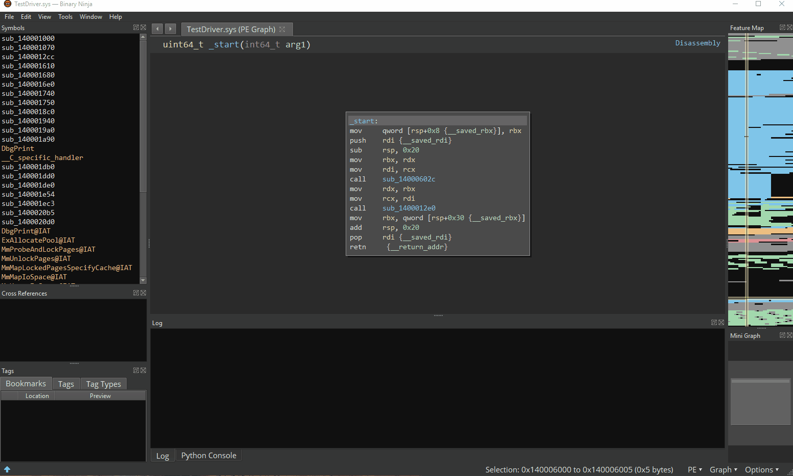

# Windows Driver Analyzer (v1.0.0)

Author: **shareef12**
_Find IRP dispatch routines and valid IOCTLs in a Windows kernel driver_


## Description:

This plugin will try to find and label IRP dispatch routines initialized in the
DriverEntry routine. Additionally, this plugin will attempt to identify valid
IOCTL control codes that the driver supports. Handler code for detected IOCTLs
will be labeled, and CTL\_CODE macros will be generated.




## Installation Instructions

This plugin requires angr to be installed and available on sys.path.

### Windows

The Windows distribution of Binary Ninja bundles a copy of python2.7. In order
to install angr, you must install python2.7 on your system or in a virtualenv
and make it available on sys.path. Note that attempting to install angr in the
bundled python error will likely run into errors. On Windows systems, this
plugin will automatically add "C:\Python27\Lib\site-packages" to sys.path.

1. Install Python2.7 to "C:\Python27".

1. From an Administrator command prompt, install angr.

    ```
    C:\Python27\python.exe -m pip install angr
    ```

1. Copy this plugin to the Binary Ninja plugins folder at
   "%appdata%\Binary Ninja\plugins".

### Linux

1. Install angr.

    ```
    pip install angr
    ```

1. Copy this plugin to the Binary Ninja plugins folder at
   "~/.binaryninja/plugins/".


## Minimum Version

This plugin requires the following minimum version of Binary Ninja:

 * 1689


## Required Dependencies

The following dependencies are required for this plugin:

 * pip - angr


## License

This plugin is released under a MIT license.


## Metadata Version

2
